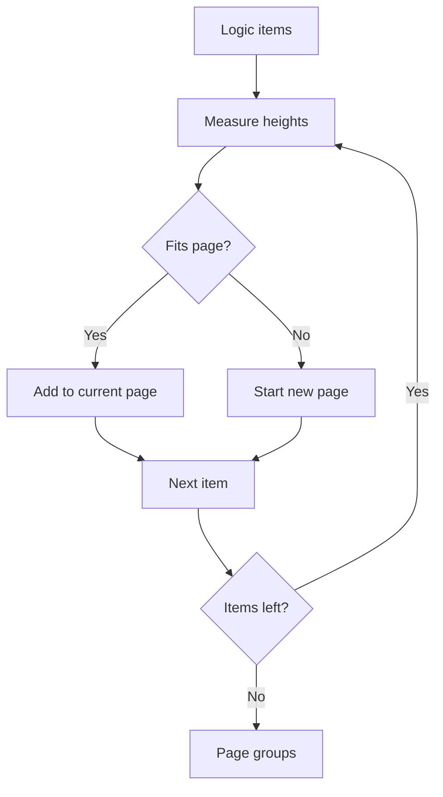

# Preview Zoom and Teacher Guide Pagination Plan

## Context and Constraints
- Current preview scaling relies on a hard-coded transform in [`App.tsx`](App.tsx:317) that shrinks the A4 wrapper to keep it within the viewport, creating unreadable pages.
- Teacher guide pagination is limited by `logicGuideCutoff` logic inside [`components/A4Preview.tsx`](components/A4Preview.tsx:198), producing at most two guide pages and truncating overflowed content.
- The print stylesheet in [`index.html`](index.html:13) forces A4 sizing at `@media print`; any responsive zooming must be confined to screen media and removed during print/export.

## Preview Zoom and Fit-to-Width UX
1. **State Model**
   - Store `zoomMode` with values `{ fitWidth, manual }` alongside a numeric `zoomScale` in [`App.tsx`](App.tsx:24).
   - Track `containerWidth` via a `ResizeObserver` bound to `#scroll-area` to recalculate fit width scale when the layout changes.
2. **Scale Computation**
   - Calculate fit width as `availableWidth / A4_CONTENT_WIDTH`, where `A4_CONTENT_WIDTH` equals the rendered width of `.a4-page` (793.7px from 210mm) plus padding defined in [`index.html`](index.html:68).
   - Clamp manual zoom between 0.6 and 1.5 to balance readability and layout stability.
3. **Toolbar Placement**
   - Inject a right-aligned zoom toolbar into the preview header block around [`App.tsx`](App.tsx:226) with buttons: `Zoom Out`, `Zoom In`, and `Fit to Width` (default active).
   - Highlight the active mode and disable zoom buttons when reaching clamp boundaries.
4. **Transform Application**
   - Replace the fixed `scale-[0.5]` class on the preview wrapper ([`App.tsx`](App.tsx:318)) with an inline `style={{ transform: \\`scale(${effectiveScale})\\` }}` combined with origin `top left` to preserve top alignment.
   - Maintain a minimum width on the page container so horizontal scroll appears naturally when zoom exceeds fit width.
5. **Print Integrity**
   - Guard scale transforms behind `@media screen` and rely on the existing print override in [`index.html`](index.html:38), which already strips transforms during printing.

## Dynamic Teacher Logic Guide Pagination
1. **Parsed Data**
   - Continue generating `LogicGuideItem[]` via `parseLogicGuide` in [`components/A4Preview.tsx`](components/A4Preview.tsx:98).
   - Add a derived structure `LogicGuidePage[]`, where each page is an ordered array of indices referencing the parsed items.
2. **Measurement Strategy**
   - Render logic blocks once within a measuring wrapper using `ref` callbacks to collect `clientHeight` for each block post-render in [`components/A4Preview.tsx`](components/A4Preview.tsx:462).
   - Use a constant `GUIDE_CONTENT_HEIGHT` computed from the inner height of the guide body minus header/footer (retrieve from `logicGuideContainerRef.current.clientHeight`).
3. **Pagination Algorithm**
   - Iterate through measured heights, aggregating blocks until the next block would exceed `GUIDE_CONTENT_HEIGHT`; when it does, start a new page and continue.
   - Keep each logic block intact as required by the user; if a single block exceeds available height, flag it for manual review (see Risks section).
4. **Mermaid Flow**

5. **Rendering**
   - Map each `LogicGuidePage` to its own `.a4-page` section, using `LogicGuideRenderer` to display the subset of items.
   - Replace the static page 4/5 rendering in [`components/A4Preview.tsx`](components/A4Preview.tsx:447) with a loop over `LogicGuidePage[]` to produce as many guide pages as necessary.
6. **Teacher Page Numbering**
   - Separate numbering from student-facing pages. Continue student counters as before but introduce `teacherPageIndex` footer text like `Teacher Page X of Y`, where `Y` equals `LogicGuidePage.length`.

## Component Touch Points
- [`App.tsx`](App.tsx:224): Introduce zoom toolbar UI and handlers tied to new zoom state.
- [`App.tsx`](App.tsx:317): Replace Tailwind scale utility with computed `transform` and manage scroll behavior.
- [`components/A4Preview.tsx`](components/A4Preview.tsx:150): Remove `logicGuideCutoff` state, add pagination state, and wire measurement logic.
- [`components/A4Preview.tsx`](components/A4Preview.tsx:502): Swap the static second guide page for a map over dynamically generated pages.

## Verification Checklist
1. Ensure default load in student mode displays pages near 100% zoom while allowing horizontal scroll when necessary.
2. Toggle between Fit to Width and manual zoom states; confirm toolbar reflects selection and scale persists between mode switches.
3. Generate a long bilingual logic guide to verify all questions appear across multiple teacher pages without clipping.
4. Run browser print preview to confirm pages snap to true A4 dimensions with no toolbar artifacts and accurate numbering.
5. Export PNG via existing flow to ensure html2canvas captures each page at correct zoom (it reads post-transform scale, so fit width must be accounted for).

## Risks and Mitigations
- **Oversized single logic block**: If one explanation exceeds available height, display a warning badge in the block header and optionally auto-append `Continued` text to prompt manual editing.
- **Resize thrash**: Debounce the `ResizeObserver` callback or cache calculated scale to avoid re-render loops when users drag the window.
- **Zoom interactions with downloads**: Ensure `html2canvas` uses `scale: 1` and temporarily strips the preview transform to capture full-resolution PNGs, then restore the user-selected zoom.
- **Ref measurement timing**: Use `useLayoutEffect` with guards to avoid infinite pagination recomputations; compare previous `LogicGuidePage[]` before updating state.
